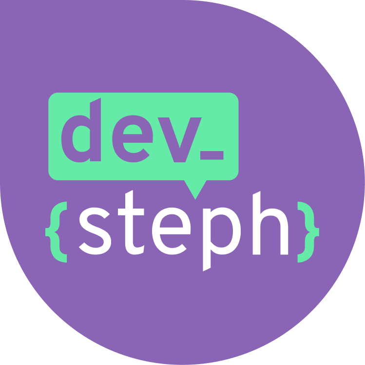

## Olá, meu nome é Stephanie Cardoso!
 

 

 <strong>Desenvolvedora Backend</strong> na Globo, desde 2018. Trabalho no time de CDN Live, que é responsável pela entrega dos vídeos ao vivo da plataforma de streaming de vídeo da Globo, o globoplay.

  Linguagens: <strong>Golang</strong> e <strong>Ruby</strong>.

   Banco de Dados: <strong>Redis</strong> e <strong>MySQL</strong>.

  Outros: Docker, Kubernetes, Terraform, GCP, CI/CD.

 

<strong>Contatos:</strong>

  
  

